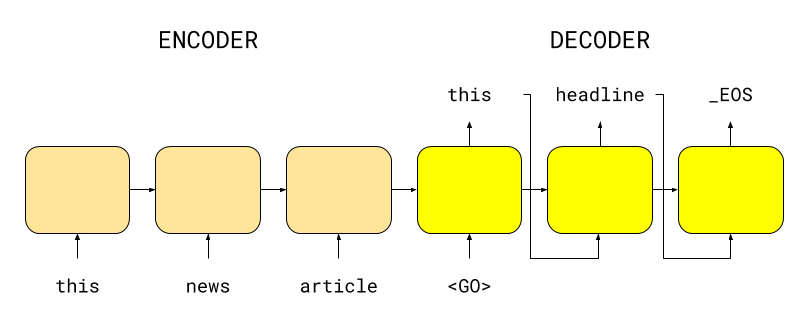

# Headliner

The goal of this project is to generate headlines from news articles.

In particular, we use sequence-to-sequence (seq2seq) under the hood, 
an encoder-decoder framework. We provide a very simple interface to train 
and deploy seq2seq models. Although this library was created internally to 
generate headlines, you can also use it for other tasks like machine translations,
text summarization and many more.



We built this library with the following goals in mind:

* Easy-to-use for training and deployment
* Uses TensorFlow 2.0
* Modular classes: text preprocessing, modeling, evaluation
* Extensible for different encoder-decoder models
* Works on large text data

## Installation
There are two ways to install Headliner:

* Install Headliner from PyPI (recommended):
```
pip install headliner
```

* Install Headliner from the GitHub source:
```
git clone https://github.com/as-ideas/headliner.git
cd headliner
python setup.py install
```

## Usage 

### Training

```
from headliner.trainer import Trainer
from headliner.model.summarizer_attention import SummarizerAttention

data = [('You are the stars, earth and sky for me!', 'I love you.'),
        ('You are great, but I have other plans.', 'I like you.')]

summarizer = SummarizerAttention(lstm_size=16, embedding_size=10)
trainer = Trainer(batch_size=2, steps_per_epoch=100)
trainer.train(summarizer, data, num_epochs=2)
```

### Prediction

```
from headliner.model.summarizer_attention import SummarizerAttention

path_to_model = 'model_path/'
summarizer = SummarizerAttention.load(path_to_model)
summarizer.predict('You are the stars, earth and sky for me!')
```

## Cite this work
Please cite Headliner in your publications if this is useful for your research. Here is an example BibTeX entry:
```
@misc{axelspringerai2019headliners,
  title={Headliner},
  author={Christian Schäfer & Dat Tran},
  year={2019},
  howpublished={\url{https://github.com/as-ideas/headliner}},
}
```

## Maintainers
* Christian Schäfer, github: [cschaefer26](https://github.com/cschaefer26)
* Dat Tran, github: [datitran](https://github.com/datitran)

## Copyright

See [LICENSE](LICENSE) for details.