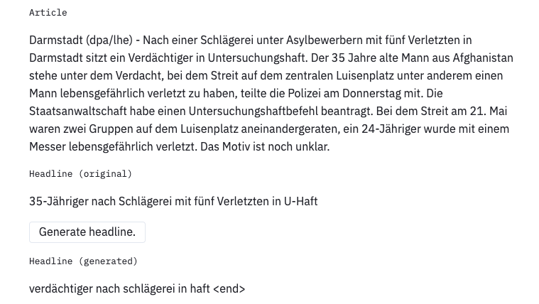

# Headliner

[](https://dev.azure.com/axelspringerai/Public/_build/latest?definitionId=2&branchName=master)
[](https://travis-ci.org/as-ideas/headliner)
[](https://as-ideas.github.io/headliner/)
[](https://codecov.io/gh/as-ideas/headliner)
[](https://pypi.org/project/headliner/)
[](https://github.com/as-ideas/headliner/blob/master/LICENSE)

Headliner is a sequence modeling library that eases the training and **in particular, the deployment of custom sequence models**
for both researchers and developers. You can very easily deploy your models in a few lines of code. It was originally
built for our own research to generate headlines from [Welt news articles](https://www.welt.de/) (see figure 1). That's why we chose the name, Headliner.

<p align="center">
  
</p>
<p align="center">
  <b>Figure 1:</b> One example from our Welt.de headline generator.
</p>

## Update 21.01.2020
The library now supports fine-tuning pre-trained BERT models with 
custom preprocessing as in [Text Summarization with Pretrained Encoders](https://arxiv.org/pdf/1908.08345.pdf)!

<!--
check out 
[this](https://colab.research.google.com/github/as-ideas/headliner/blob/master/notebooks/BERT_Translation_Example.ipynb)
tutorial on colab!
-->

## 🧠 Internals
We use sequence-to-sequence (seq2seq) under the hood,
an encoder-decoder framework (see figure 2). We provide a very simple interface to train
and deploy seq2seq models. Although this library was created internally to
generate headlines, you can also use it for **other tasks like machine translations,
text summarization and many more.**

<p align="center">
  
</p>
<p align="center">
  <b>Figure 2:</b> Encoder-decoder sequence-to-sequence model.
</p>

### Why Headliner?

You may ask why another seq2seq library? There are a couple of them out there already.
For example, Facebook has [fairseq](https://github.com/pytorch/fairseq), Google has [seq2seq](https://github.com/google/seq2seq)
and there is also [OpenNMT](http://opennmt.net/).
Although those libraries are great, they have a few drawbacks for our use case e.g. the former doesn't focus much on production
whereas the Google one is not actively maintained. OpenNMT was the closest one to match our requirements i.e.
it has a strong focus on production. However, we didn't like that their workflow
(preparing data, training and evaluation) is mainly done via the command line.
They also expose a well-defined API though but the complexity there is still too high with too much custom code
(see their [minimal transformer training example](https://github.com/OpenNMT/OpenNMT-tf/blob/master/examples/library/minimal_transformer_training.py)).    

Therefore, we built this library for us with the following goals in mind:

* Easy-to-use API for training and deployment (only a few lines of code)
* Uses TensorFlow 2.0 with all its new features (`tf.function`, `tf.keras.layers` etc.)
* Modular classes: text preprocessing, modeling, evaluation
* Extensible for different encoder-decoder models
* Works on large text data

For more details on the library, read the documentation at: [https://as-ideas.github.io/headliner/](https://as-ideas.github.io/headliner/)

Headliner is compatible with Python 3.6 and is distributed under the MIT license.

## ⚙️ Installation
> ⚠️ Before installing Headliner, you need to install TensorFlow as we use this as our deep learning framework. For more
> details on how to install it, have a look at the [TensorFlow installation instructions](https://www.tensorflow.org/install/).

Then you can install Headliner itself. There are two ways to install Headliner:

* Install Headliner from PyPI (recommended):

```bash
pip install headliner
```

* Install Headliner from the GitHub source:

```bash
git clone https://github.com/as-ideas/headliner.git
cd headliner
python setup.py install
```

## 📖 Usage

### Training
For the training, you need to import one of our provided models or create your own custom one. Then you need to
create the dataset, a `tuple` of input-output sequences, and then train it:

```python
from headliner.trainer import Trainer
from headliner.model.transformer_summarizer import TransformerSummarizer

data = [('You are the stars, earth and sky for me!', 'I love you.'),
        ('You are great, but I have other plans.', 'I like you.')]

summarizer = TransformerSummarizer(embedding_size=64, max_prediction_len=20)
trainer = Trainer(batch_size=2, steps_per_epoch=100)
trainer.train(summarizer, data, num_epochs=2)
summarizer.save('/tmp/summarizer')
```

### Prediction
The prediction can be done in a few lines of code:

```python
from headliner.model.transformer_summarizer import TransformerSummarizer

summarizer = TransformerSummarizer.load('/tmp/summarizer')
summarizer.predict('You are the stars, earth and sky for me!')
```

### Models
Currently available models include a basic encoder-decoder, 
an encoder-decoder with Luong attention, the transformer and 
a transformer on top of a pre-trained BERT-model:

```python
from headliner.model.basic_summarizer import BasicSummarizer
from headliner.model.attention_summarizer import AttentionSummarizer
from headliner.model.transformer_summarizer import TransformerSummarizer
from headliner.model.bert_summarizer import BertSummarizer

basic_summarizer = BasicSummarizer()
attention_summarizer = AttentionSummarizer()
transformer_summarizer = TransformerSummarizer()
bert_summarizer = BertSummarizer()
```

### Advanced training
Training using a validation split and model checkpointing:

```python
from headliner.model.transformer_summarizer import TransformerSummarizer
from headliner.trainer import Trainer

train_data = [('You are the stars, earth and sky for me!', 'I love you.'),
              ('You are great, but I have other plans.', 'I like you.')]
val_data = [('You are great, but I have other plans.', 'I like you.')]

summarizer = TransformerSummarizer(num_heads=1,
                                   feed_forward_dim=512,
                                   num_layers=1,
                                   embedding_size=64,
                                   max_prediction_len=50)
trainer = Trainer(batch_size=8,
                  steps_per_epoch=50,
                  max_vocab_size_encoder=10000,
                  max_vocab_size_decoder=10000,
                  tensorboard_dir='/tmp/tensorboard',
                  model_save_path='/tmp/summarizer')

trainer.train(summarizer, train_data, val_data=val_data, num_epochs=3)
```

### Advanced prediction
Prediction information such as attention weights and logits can be accessed via predict_vectors returning a dictionary:

```python
from headliner.model.transformer_summarizer import TransformerSummarizer

summarizer = TransformerSummarizer.load('/tmp/summarizer')
summarizer.predict_vectors('You are the stars, earth and sky for me!')
```

### Resume training
A previously trained summarizer can be loaded and then retrained. In this case the data preprocessing and vectorization is loaded from the model.

```python
train_data = [('Some new training data.', 'New data.')] * 10

summarizer_loaded = TransformerSummarizer.load('/tmp/summarizer')
trainer = Trainer(batch_size=2)
trainer.train(summarizer_loaded, train_data)
summarizer_loaded.save('/tmp/summarizer_retrained')
```

### Use pretrained GloVe embeddings
Embeddings in GloVe format can be injected in to the trainer as follows. Optionally, set the embedding to non-trainable.

```python
trainer = Trainer(embedding_path_encoder='/tmp/embedding_encoder.txt',
                  embedding_path_decoder='/tmp/embedding_decoder.txt')

# make sure the embedding size matches to the embedding size of the files
summarizer = TransformerSummarizer(embedding_size=64,
                                   embedding_encoder_trainable=False,
                                   embedding_decoder_trainable=False)
```

### Custom preprocessing
A model can be initialized with custom preprocessing and tokenization:

```python
from headliner.preprocessing.preprocessor import Preprocessor

train_data = [('Some inputs.', 'Some outputs.')] * 10

preprocessor = Preprocessor(filter_pattern='',
                            lower_case=True,
                            hash_numbers=False)
train_prep = [preprocessor(t) for t in train_data]
inputs_prep = [t[0] for t in train_prep]
targets_prep = [t[1] for t in train_prep]

# Build tf subword tokenizers. Other custom tokenizers can be implemented
# by subclassing headliner.preprocessing.Tokenizer
from tensorflow_datasets.core.features.text import SubwordTextEncoder
tokenizer_input = SubwordTextEncoder.build_from_corpus(
inputs_prep, target_vocab_size=2**13, reserved_tokens=[preprocessor.start_token, preprocessor.end_token])
tokenizer_target = SubwordTextEncoder.build_from_corpus(
    targets_prep, target_vocab_size=2**13,  reserved_tokens=[preprocessor.start_token, preprocessor.end_token])

vectorizer = Vectorizer(tokenizer_input, tokenizer_target)
summarizer = TransformerSummarizer(embedding_size=64, max_prediction_len=50)
summarizer.init_model(preprocessor, vectorizer)

trainer = Trainer(batch_size=2)
trainer.train(summarizer, train_data, num_epochs=3)
```


### Use pre-trained BERT embeddings
Pre-trained BERT models can be included as follows. 
Be aware that pre-trained BERT models are expensive to train and require custom preprocessing!

```python
from headliner.preprocessing.bert_preprocessor import BertPreprocessor
from spacy.lang.en import English

train_data = [('Some inputs.', 'Some outputs.')] * 10

# use BERT-specific start and end token
preprocessor = BertPreprocessor(nlp=English()
train_prep = [preprocessor(t) for t in train_data]
targets_prep = [t[1] for t in train_prep]


from tensorflow_datasets.core.features.text import SubwordTextEncoder
from transformers import BertTokenizer
from headliner.model.bert_summarizer import BertSummarizer

# Use a pre-trained BERT embedding and BERT tokenizer for the encoder 
tokenizer_input = BertTokenizer.from_pretrained('bert-base-uncased')
tokenizer_target = SubwordTextEncoder.build_from_corpus(
    targets_prep, target_vocab_size=2**13,  reserved_tokens=[preprocessor.start_token, preprocessor.end_token])

vectorizer = BertVectorizer(tokenizer_input, tokenizer_target)
summarizer = BertSummarizer(num_heads=2,
                            feed_forward_dim=512,
                            num_layers_encoder=0,
                            num_layers_decoder=4,
                            bert_embedding_encoder='bert-base-uncased',
                            embedding_size_encoder=768,
                            embedding_size_decoder=768,
                            dropout_rate=0.1,
                            max_prediction_len=50))
summarizer.init_model(preprocessor, vectorizer)

trainer = Trainer(batch_size=2)
trainer.train(summarizer, train_data, num_epochs=3)
```


### Training on large datasets
Large datasets can be handled by using an iterator:

```python
def read_data_iteratively():
    return (('Some inputs.', 'Some outputs.') for _ in range(1000))

class DataIterator:
    def __iter__(self):
        return read_data_iteratively()

data_iter = DataIterator()

summarizer = TransformerSummarizer(embedding_size=10, max_prediction_len=20)
trainer = Trainer(batch_size=16, steps_per_epoch=1000)
trainer.train(summarizer, data_iter, num_epochs=3)
```

## 🤝 Contribute
We welcome all kinds of contributions such as new models, new examples and many more.
See the [Contribution](CONTRIBUTING.md) guide for more details.

## 📝 Cite this work
Please cite Headliner in your publications if this is useful for your research. Here is an example BibTeX entry:
```BibTeX
@misc{axelspringerai2019headliners,
  title={Headliner},
  author={Christian Schäfer & Dat Tran},
  year={2019},
  howpublished={\url{https://github.com/as-ideas/headliner}},
}
```

## 🏗 Maintainers
* Christian Schäfer, github: [cschaefer26](https://github.com/cschaefer26)
* Dat Tran, github: [datitran](https://github.com/datitran)

## © Copyright

See [LICENSE](LICENSE) for details.

## References

[Text Summarization with Pretrained Encoders](https://arxiv.org/pdf/1908.08345.pdf)

[Effective Approaches to Attention-based Neural Machine Translation](https://arxiv.org/abs/1508.04025)

## Acknowlegements

https://www.tensorflow.org/tutorials/text/transformer

https://github.com/huggingface/transformers

https://machinetalk.org/2019/03/29/neural-machine-translation-with-attention-mechanism/

